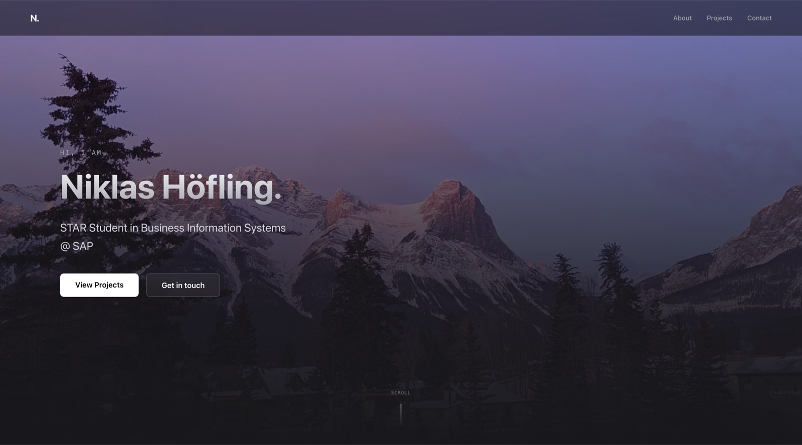

# niklas-hoefling.de

Personal portfolio of **Niklas Höfling** — STAR Student in Business Information Systems at SAP & DHBW Mannheim, exploring the intersection of enterprise engineering and AI.

**Live:** [niklas-hoefling.de](https://niklas-hoefling.de)



---

## Tech Stack

| Layer | Technology |
|-------|-----------|
| Framework | [Next.js 16](https://nextjs.org/) — App Router, React 19, static generation |
| Styling | [Tailwind CSS 4](https://tailwindcss.com/) |
| Language | [TypeScript](https://www.typescriptlang.org/) |
| Icons | [Lucide React](https://lucide.dev/) |
| Fonts | Geist Sans & Geist Mono via `next/font` |
| Deployment | [Vercel](https://vercel.com/) |

## Getting Started

```bash
npm install
npm run dev       # http://localhost:3000
```

```bash
npm run build     # production build
npm run start     # serve production build locally
npm run lint      # ESLint
```

## Project Structure

```
app/
├── components/   # Hero, Navbar, About, Experience, Projects, Footer
├── contact/      # Contact page
├── impressum/    # Legal notice (German law)
├── projects/     # Dynamic project detail pages
├── layout.tsx    # Root layout + metadata
└── page.tsx      # Home page
lib/
└── projects.ts   # Project data
public/           # Static assets (images)
```

## License

The **source code** is released under the [MIT License](LICENSE) — feel free to use it as a reference or starting point for your own portfolio.

The **content** (text, images, visual identity) is copyright © 2026 Niklas Höfling and is not covered by the MIT License. Please do not copy or redistribute it.
